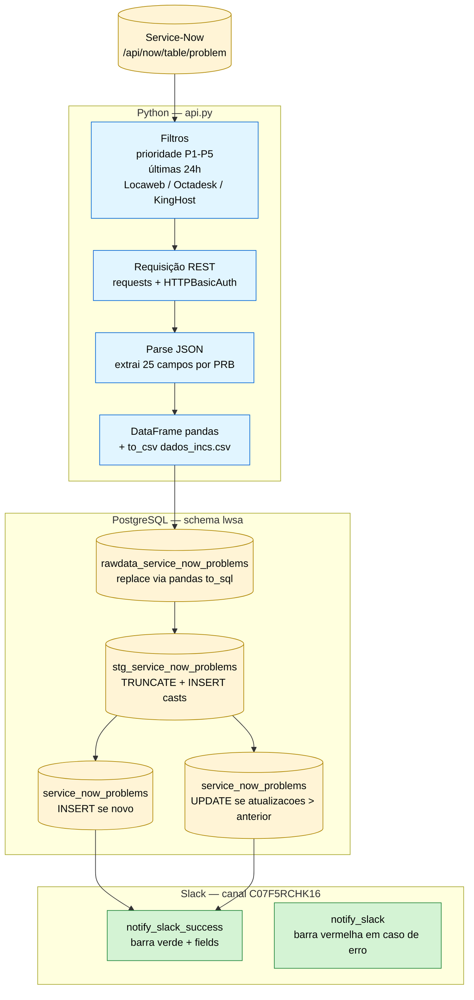

# LWSA Problems — carga diária dos PRBs do Service-Now

Rotina ETL que consulta o endpoint `/api/now/table/problem` do Service-Now, normaliza os registros e persiste em camadas (`rawdata` → `stg` → final) no schema `lwsa` do PostgreSQL, com alertas Slack ao fim da execução.

## Estrutura do Projeto

- `api.py` — script principal: leitura do `config.ini`, consulta REST com `requests`, transformação com `pandas` e orquestração da carga via `SQLAlchemy`.
- `function_logger.py` — configuração padrão de logging (arquivo `logs.log` rotativo).
- `notifica.py` — envio de notificações Slack (sucesso/erro) com layout em `attachments` (barra colorida + fields).
- `CreateTabelasProblems.sql` — DDL das tabelas `stg_service_now_problems` e `service_now_problems`.
- `StgInsereDados.sql` — INSERT da raw para a staging, com casts, `NULLIF`, conversão de timestamps e derivação de `tipo_usuario`/`fonte_de_dados`.
- `InsereDados.sql` — INSERT da staging para a tabela final (deduplicado por `numero`).
- `AtualizaDados.sql` — UPDATE da tabela final quando `atualizacoes` (sys_mod_count) cresceu na staging.
- `AlimentaPRB.bat` — wrapper para agendamento Windows (`python api.py`).

## Arquitetura — fluxo de alto nível



## Pré-requisitos

- Python 3.8+
- Acesso à API Service-Now (usuário/senha com permissão de leitura em `problem`)
- PostgreSQL com schema `lwsa` e permissão de DDL + DML
- Token de bot do Slack com escopo `chat:write` no canal `C07F5RCHK16`

Pacotes Python (instalar via `pip`):

```
requests
pandas
sqlalchemy
psycopg2-binary
slack_sdk
```

## Configuração — `../config.ini`

O `api.py` lê o `config.ini` localizado um nível acima da pasta `problemas/`. Seções esperadas:

```ini
[service_now]
username = ...
pwd = ...
instance = ...
timeout = 60

[database]
server = host:porta
database = ...
uid = ...
pwd = ...

[slack]
bot_token = xoxb-...
```

> `SLACK_BOT_TOKEN` no ambiente tem prioridade sobre o `bot_token` do `config.ini`.

## Preparação do banco (primeira execução)

Executar uma única vez para criar `stg_service_now_problems` e `service_now_problems`:

```bash
psql -h <host> -U <user> -d <db> -f CreateTabelasProblems.sql
```

A tabela `rawdata_service_now_problems` é criada/sobrescrita automaticamente pelo `pandas.to_sql(..., if_exists='replace')` em cada execução.

## Execução

Diretamente:

```bash
python api.py
```

Ou via batch (usado pelo agendador):

```bat
AlimentaPRB.bat
```

Saída esperada no log:

```
Banco conectado com sucesso
Dados carregados na tabela: rawdata_service_now_problems...
Tabela lwsa.stg_service_now_problems truncada com sucesso
N linhas inseridas na tabela lwsa.stg_service_now_problems.
N linhas inseridas na tabela lwsa.service_now_problems.
M linhas atualizadas na tabela lwsa.service_now_problems.
Conexão com banco encerrada
```

## Notificações Slack

Ao fim de cada execução, `notify_slack_success` envia ao canal `C07F5RCHK16` um attachment verde com:

- Header `:white_check_mark: Rotina executada com sucesso!`
- Título `Rotina LWSA (Carrega Problems P1-P5) executada com sucesso`
- Mensagem com totais de inseridas/atualizadas
- Fields lado a lado: `Registros Inseridos` / `Registros Atualizados`

Em caso de exceção dentro do bloco principal, `notify_slack` envia attachment vermelho com o traceback resumido.

## Schema das tabelas (resumo)

`service_now_problems` (chave primária: `numero`) — 29 colunas:

| Grupo | Colunas |
|---|---|
| Identificação | `numero`, `organizacao`, `task_for` |
| Atribuição | `servidor`, `grupo_designado`, `designado_para` |
| Classificação | `prioridade`, `produto`, `categoria`, `subcategoria`, `status`, `origem` |
| Datas | `data_abertura`, `data_encerrado` |
| Autoria | `aberto_por`, `fechado_por`, `id_departamento`, `tipo_usuario` |
| Encerramento | `codigo_encerramento`, `chamado_externo`, `prb_revisado` |
| Textuais | `descricao_curta`, `descricao`, `solucao_alternativa`, `fechamento` |
| Controle | `atualizacoes`, `fonte_de_dados`, `data_insercao`, `data_modificacao` |

A tabela `stg_service_now_problems` tem o mesmo schema, sem PK.